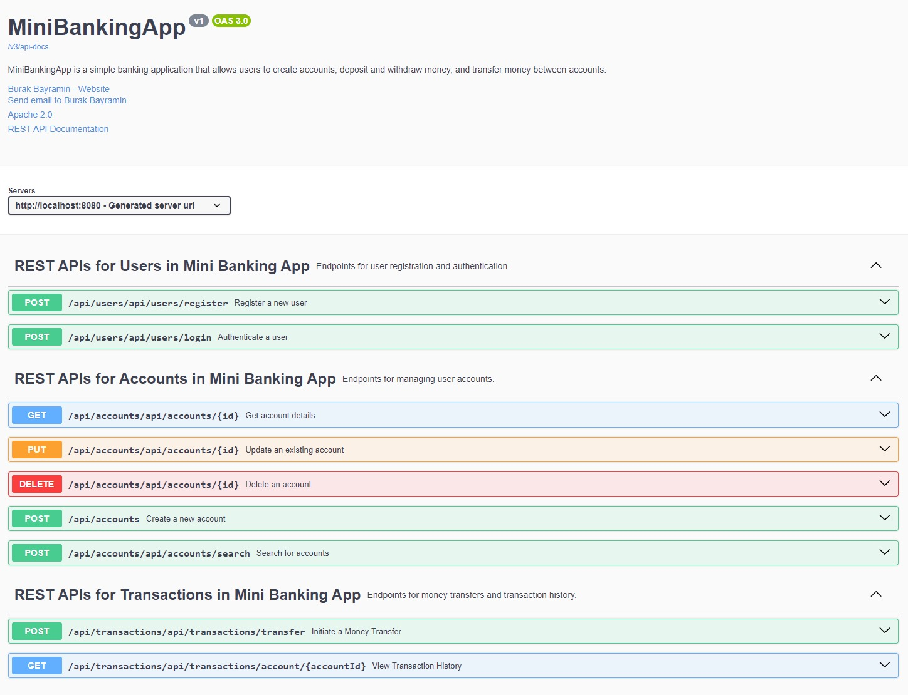
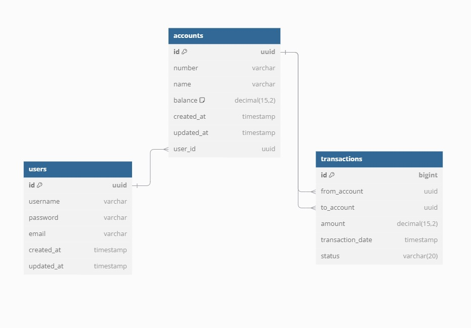

# 🚀 Mini Banking Application

[](https://github.com/burakbayramin/mini-banking-app)
[](https://github.com/burakbayramin/mini-banking-app/blob/main/LICENSE)

Welcome to the **Mini Banking Application**! A sleek and secure platform that allows users to manage their finances with ease. Whether you're looking to create multiple accounts, transfer funds, or track your transaction history, our application has you covered.


## 🛠️ Table of Contents

- [Features](#features)
- [Tech Stack](#tech-stack)
- [Getting Started](#getting-started)
  - [Prerequisites](#prerequisites)
  - [Backend Setup](#backend-setup)
  - [Frontend Setup](#frontend-setup)
- [API Documentation](#api-documentation)
- [📊 Graphics and Photos](#-graphics-and-photos)
- [📸 Screenshots](#screenshots)
- [🤝 Contributing](#contributing)
- [📝 License](#license)

## 🎯 Features

### User Management
- **Register**: Create a new user account with a unique username and email.
- **Login**: Secure authentication using JWT tokens.

### Account Operations
- **Create Account**: Open multiple bank accounts under a single user profile.
- **Search Accounts**: Filter and search accounts by number or name.
- **Update Account**: Modify account details securely.
- **Delete Account**: Remove accounts when no longer needed.
- **View Account Details**: Access comprehensive account information, including current balance.

### Transaction Operations
- **Initiate Money Transfer**: Seamlessly transfer funds between accounts with real-time status updates.
- **View Transaction History**: Track all past transactions for detailed financial insights.

### Frontend Features
- **Responsive Design**: User-friendly interface optimized for all devices.
- **State Management**: Efficient handling of application state using Redux.
- **Secure API Integration**: Robust communication with backend services using Axios.
- **Routing and Navigation**: Smooth navigation between different sections using React Router.

## 🖥️ Tech Stack

### Backend
- **Spring Boot**: Robust framework for building RESTful APIs.
- **JWT**: Secure authentication mechanism.
- **Hibernate/JPA**: ORM for database interactions.
- **Springdoc Swagger**: Interactive API documentation.
- **H2 Database**: In-memory relational database for development and testing.

### Frontend
- **React**: Dynamic user interface library.
- **Redux**: State management.
- **Axios**: Promise-based HTTP client.
- **React Router**: Declarative routing for React applications.

### Database
- **H2 Database**: Lightweight in-memory database for ease of setup and testing.

## 🚀 Getting Started

### Prerequisites

- **Java 17** or higher
- **Node.js** and **npm**
- **Git**

### Backend Setup

1. **Clone the Repository**
   ```bash
   git clone https://github.com/burakbayramin/mini-banking-app.git
   cd mini-banking-app/backend

2. **Configure Environment Variables**

    Create an `application.yml` file in the `backend/src/main/resources` directory with the following content:

    ```yaml
    server:
      port: 8080

    spring:
      application:
        name: mini-banking-app

      datasource:
        url: jdbc:h2:mem:db;DB_CLOSE_DELAY=-1;DB_CLOSE_ON_EXIT=FALSE
        driver-class-name: org.h2.Driver
        username: sa
        password: password
      h2:
        console:
          enabled: true
          path: /h2-console
      jpa:
        hibernate:
          ddl-auto: update
        show-sql: true
      flyway:
        enabled: true
        locations: classpath:db/migration
        baseline-on-migrate: true

    jwt:
      secret: secret
      expiration: 86400000

    springdoc:
      api-docs:
        path: /v3/api-docs
      swagger-ui:
        path: /swagger-ui.html
    ```

    - The above configuration uses an H2 in-memory database. This is suitable for development and testing purposes. For production, consider using a more robust database like PostgreSQL.
    - Flyway is enabled for database migrations. Ensure your migration scripts are placed in the `src/main/resources/db/migration` directory.
    - The JWT secret should be kept secure. Consider using environment variables or a secrets manager for sensitive configurations in production.

3. **Build and Run Backend**

    Ensure you have Maven installed. Then, execute the following commands:

    ```bash
    ./mvnw clean install
    ./mvnw spring-boot:run
    ```

    The backend API will be accessible at `http://localhost:8080`.

4. **Access H2 Console (Optional)**

    To view the in-memory database, navigate to `http://localhost:8080/h2-console` in your browser.

    - **JDBC URL**: `jdbc:h2:mem:db`
    - **Username**: `sa`
    - **Password**: `password`

### Frontend Setup

1. **Navigate to the Frontend Directory**

    ```bash
    cd ../frontend
    ```

2. **Install Dependencies**

    ```bash
    npm install
    ```

3. **Configure Environment Variables**

    Create a `.env` file in the `frontend` directory with the following content:

    ```env
    REACT_APP_API_URL=http://localhost:8080/api
    ```

4. **Run Frontend**

    ```bash
    npm start
    ```

    The frontend application will open in your default browser at `http://localhost:3000`.

## 📄 API Documentation

Our API is documented using Springdoc Swagger. Once the backend is running, you can access the interactive API docs at:

[http://localhost:8080/swagger-ui.html](http://localhost:8080/swagger-ui.html)

## 📊 Graphics and Photos

This section contains graphics and photos that visually represent the architecture, database design, and other key components of our project.

### Swagger UI

Swagger user interface of the project.



### Entity-Relationship Diagram (ERD)

ERD showing the relationships between `User`, `Account`, and `Transaction` models.



### User Interface Designs
